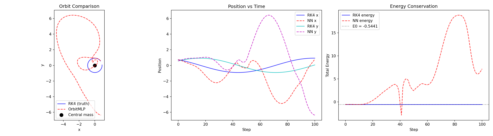

# OrbitMLP: Neural Network Orbital Trajectory Predictor

<a href="https://huggingface.co/asgeirr89"></a>


## Overview

**OrbitMLP** is a deep learning model that learns to predict orbital trajectories using Keplerian dynamics. Instead of numerically integrating orbits step-by-step with RK4, the neural network learns to directly predict the next state given the current state.

The model is trained using physics-informed loss functions that enforce energy conservation and angular momentum conservation, in addition to standard MSE regression on trajectory data.

**Key Features:**
- Pure JAX/Flax implementation for automatic differentiation and GPU acceleration
- Physics-informed training with energy and angular momentum constraints
- Lightweight MLP architecture with residual blocks
- Direct trajectory prediction without iterative solvers

## Demo

The following results show OrbitMLP compared against the ground-truth RK4 integrator:



- **Left Panel:** Trajectory comparison showing an elliptic orbit. Blue = RK4 (ground truth), Red = OrbitMLP prediction. The neural network learns to reproduce the orbital shape with high fidelity.
- **Center Panel:** Position vs time for x and y coordinates. The NN closely follows RK4 across the entire trajectory.
- **Right Panel:** Energy conservation comparison. Both RK4 and the neural network maintain approximately constant total energy throughout the orbit.

## Installation

```bash
pip install jax jaxlib flax optax numpy matplotlib pyyaml
```

## Usage

### Training

Configure your hyperparameters in `config.yaml` and run:

```bash
python main.py
```

### Inference / Prediction

```python
import jax
import jax.numpy as jnp
import numpy as np
from flax import serialization
from model import OrbitMLP
from train import make_predict_trajectory

# Load the model
with open("models/orbitmlp_20260505_033302.flax", "rb") as f:
    params = serialization.from_bytes(jax.random.PRNGKey(0), f.read())

# Create model and prediction function
model = OrbitMLP()
predict_trajectory = make_predict_trajectory(model)

# Predict 500 steps from initial state [x, y, vx, vy]
init_state = jnp.array([1.5, 0.0, 0.0, 0.8], dtype=jnp.float32)
num_steps = 500
nn_traj = predict_trajectory(params, init_state, num_steps)

print(f"Trajectory shape: {nn_traj.shape}")  # (501, 4)
```

### Compare with RK4 Ground Truth

```python
from physics_engine import rk4_step, energy

dt = 0.05
gm = 1.0
num_steps = 500

# RK4 integration
rk4_traj = np.zeros((num_steps + 1, 4), dtype=np.float32)
rk4_traj[0] = np.array(init_state)
s = init_state
for i in range(num_steps):
    s, _ = rk4_step(s, dt, gm)
    rk4_traj[i + 1] = np.array(s)

# Compute energies
nn_energies = np.array([energy(nn_traj[i], gm) for i in range(num_steps + 1)])
rk4_energies = np.array([energy(rk4_traj[i], gm) for i in range(num_steps + 1)])

mse = np.mean((nn_traj - rk4_traj) ** 2)
energy_drift = nn_energies[-1] - nn_energies[0]

print(f"Position MSE vs RK4: {mse:.6e}")
print(f"Energy drift (NN): {energy_drift:.6e}")
```

## Architecture

### OrbitMLP

```
Input (4) → Dense(128) → ResidualBlock × 3 → Dense(4)
```

### ResidualBlock

```
x → Dense → LayerNorm → GELU → Dense → LayerNorm → GELU → Add → output
```

The model uses He normal initialization and LayerNorm for stability.

| Component | Value |
|-----------|-------|
| Hidden dimension | 128 |
| Number of residual blocks | 3 |
| Activation | GELU |
| Initialization | He normal |

## Training Details

### Hyperparameters

| Parameter | Value |
|-----------|-------|
| Epochs | 5000 |
| Batch size | 64 |
| Learning rate | 1e-3 |
| Optimizer | AdamW with cosine decay |
| Initial decay steps | 2000 |
| Final learning rate ratio | 1e-4 |

### Loss Function

```
L_total = MSE + λ_energy × L_energy + λ_angular × L_angular
```

Where:
- **MSE**: Mean squared error between predicted and target states
- **L_energy**: Mean absolute error of orbital energy (`|E_pred - E_target|`)
- **L_angular**: Variance of angular momentum (encourages conservation)
- **λ_energy = 0.1**
- **λ_angular = 0.1**

### Data Generation

Training data is generated by integrating random initial conditions using RK4:

- Random radii: uniform(0.8, 2.0)
- Random velocities: uniform(0.4, 1.2) with perpendicular direction
- 100 integration steps per trajectory at dt=0.05
- 64 trajectories per training run

## Physics

### Kepler's Equations

The model learns the two-body problem gravitational dynamics:

```
a = -GM/r³ × r
```

Where:
- `r = (x, y)` is the position vector
- `GM = 1.0` (normalized units)
- `a = (ax, ay)` is the acceleration

### Energy

Total orbital energy (conserved in bound orbits):

```
E = 0.5 × (vx² + vy²) - GM/r
```

### Angular Momentum

Angular momentum per unit mass (also conserved):

```
L = x × vy - y × vx
```

## Model Files

| File | Description |
|------|-------------|
| `orbitmlp_20260505_033302.flax` | Latest trained model |

## Project Structure

```
orbitas/
├── main.py              # Training pipeline
├── train.py             # Training utilities and loss functions
├── model.py             # OrbitMLP architecture
├── physics_engine.py    # Keplerian dynamics and RK4 integrator
├── predict.py           # Inference script
├── checks.py            # Pre-flight checks
├── config.yaml          # Hyperparameters
├── requirements.txt    # Dependencies
└── orbit_comparison.png # Example results
```

## Technologies Used

| Library | Purpose |
|---------|---------|
| **JAX** | Autodiff, XLA compilation, GPU acceleration |
| **Flax** | Neural network framework |
| **Optax** | Optimizers (AdamW + cosine decay) |
| **NumPy** | Numerical computation |
| **Matplotlib** | Visualization |

## License

MIT License - see LICENSE file for details.

## Citation

If you use this model in your research, please cite:

```bibtex
@software{orbitas,
  author = {asgeirr89},
  title = {OrbitMLP: Neural Network Orbital Trajectory Predictor},
  url = {https://huggingface.co/asgeirr89/orbitas},
  year = {2026},
}
```

---

<a href="https://huggingface.co/asgeirr89">
  
</a>